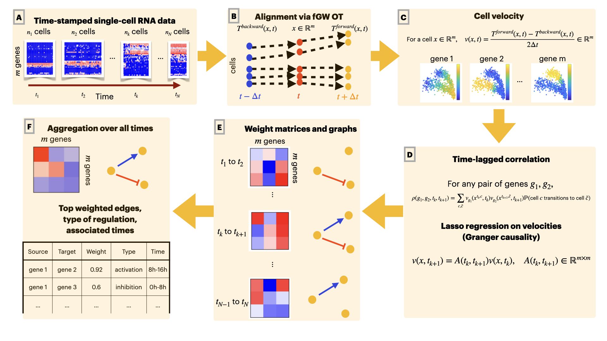

# OT-Velocity

This repo hosts scripts of OTVelo, a software for gene regulatory network inference from time-stamped gene expresssion matrices. Paper link: https://www.biorxiv.org/content/10.1101/2024.09.12.612590v1

## Introduction and overview

We introduce a framework for inferring the gene regulatory network (GRN) from time-stamped data. First, trajectory inference is performed through fused Gromov-Wasserstein, and velocities of evolution is inferred based on the coupling matrices. Finally, we can infer the GRN based on either (1) `OTVelo-Corr` the correlation between velocities, or (2) `OTVelo-Granger` Granger causality between velocities. 

## Tutorial notebook

An example for demonstration can be found from `Tutorial.ipynb`. It provides details for running the algorithm, visualizing the resulting vector field and graphs, as well as computations of metrics.

## Dependence on packages

Run `pip3 install -r requirements.txt`
to install all the required packages.

## Reproduce results

The scripts reproducing the examples on simulations can be found from `Scripts`. To reproduce the experiments from `HARISSA` simulations, use the script `Harissa-myVelo.ipynb`. To reproduce the experiments from curated networks, use the script `Curated-myVelo.ipynb`. Note that datasets need to be downloaded from their associated publications, and instructions are inserted in the two notebooks as mentioned.

Similarly, a notebook reproducing the results for a real data is provided as `Scripts/Kouno-myVelo.ipynb`. Note that the original data will need to be downloaded from https://github.com/CABSEL/SINCERITIES. 
